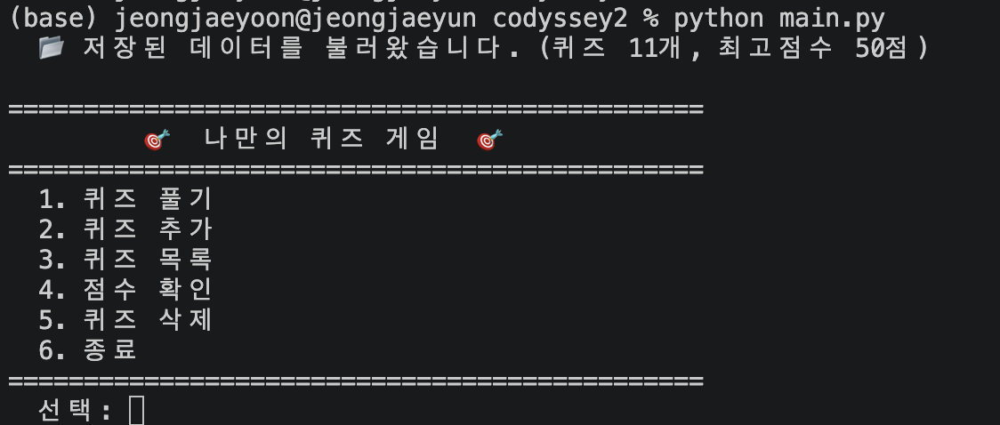
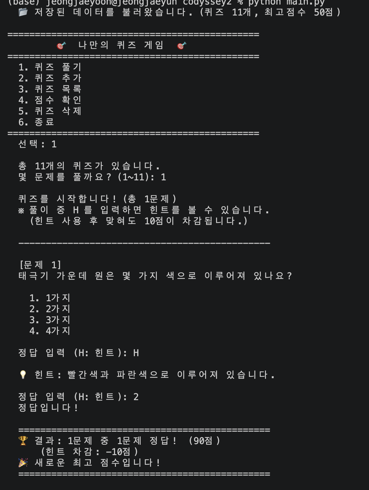
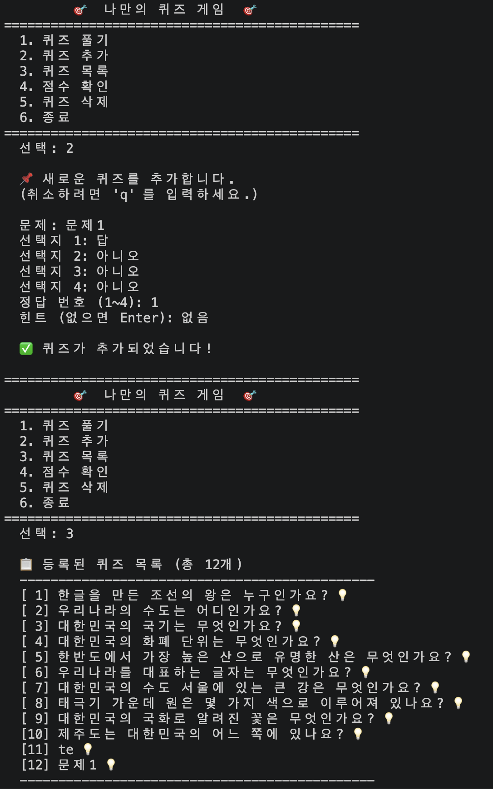
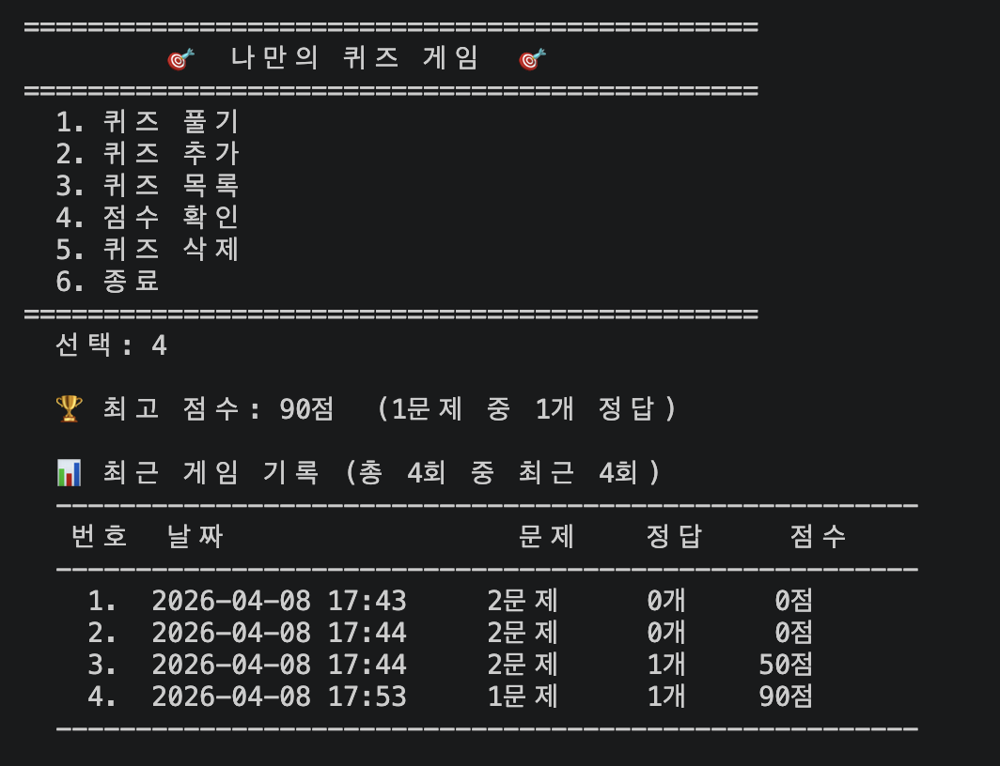
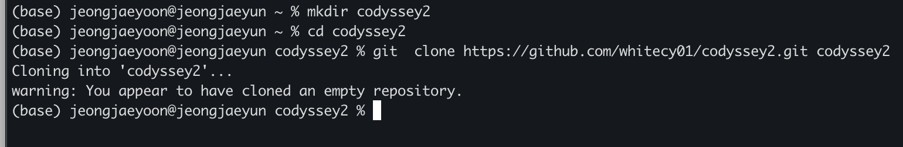
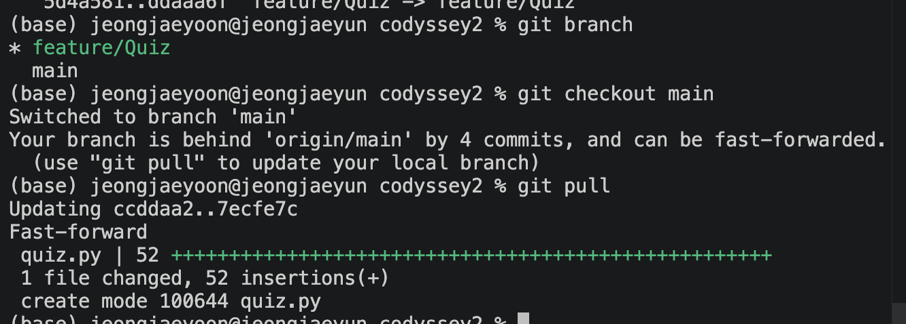

# 🎯 나만의 퀴즈 게임 — 한국 역사 퀴즈

## 프로젝트 개요
터미널에서 동작하는 한국 역사 주제의 퀴즈 게임입니다. Python 표준 라이브러리만 사용하며, 퀴즈 데이터와 최고 점수는 `state.json` 파일에 저장되어 프로그램을 재시작해도 유지됩니다.


## 퀴즈 주제 선정 이유
한국 역사와 우리나라 상식은 많은 사람이 한 번쯤 접해 본 친숙한 주제이기 때문에 퀴즈 게임에 잘 어울린다고 생각했습니다. 완전히 낯선 분야보다 접근하기 쉬워서 누구나 부담 없이 참여할 수 있고, 문제를 풀면서 자연스럽게 기본 상식도 다시 떠올릴 수 있습니다.

또한 역사와 문화 요소를 함께 담을 수 있어 문제를 다양하게 구성하기 좋았습니다. 수도, 국기, 한글, 무궁화처럼 비교적 쉬운 문제부터 시작해 점차 더 다양한 주제로 확장할 수 있어서, 학습성과 재미를 함께 줄 수 있다는 점에서 이 주제를 선택했습니다.


## 실행 방법
```bash
# 실행
python main.py
```

`state.json` 파일이 없으면 기본 퀴즈 10개가 자동으로 로드됩니다.


## 기능 목록

| 번호 | 기능 | 설명 |
|------|------|------|
| 1 | 퀴즈 풀기 | 문제 수 선택 후 랜덤 순서로 출제, 힌트 사용 가능 |
| 2 | 퀴즈 추가 | 문제·선택지 4개·정답 번호·힌트를 입력해 등록 |
| 3 | 퀴즈 목록 | 등록된 퀴즈 번호와 제목 일람 |
| 4 | 점수 확인 | 최고 점수 및 게임 기록 히스토리 출력 |
| 5 | 퀴즈 삭제 | 번호를 선택해 퀴즈 삭제 |
| 6 | 종료 | 데이터 저장 후 종료 |

### 보너스 기능

- **랜덤 출제** — 매 게임마다 문제 순서를 무작위로 섞습니다.
- **문제 수 선택** — 풀 문제 수를 1개부터 전체 수까지 직접 선택합니다.
- **힌트 기능** — 풀이 중 `H`를 입력하면 힌트를 볼 수 있습니다. 힌트를 사용해 맞혀도 해당 문제 점수에서 10점이 차감됩니다.
- **퀴즈 삭제** — 등록된 퀴즈를 번호로 선택해 삭제합니다.
- **점수 히스토리** — 최고 점수뿐 아니라 날짜·문제 수·점수를 포함한 최근 10회 기록을 저장합니다.


## 파일 구조

```
codyssey2/
├── main.py       # 진입점 — QuizGame 인스턴스 생성 및 실행
├── quiz.py       # Quiz 클래스 — 퀴즈 1개의 데이터, 출력, 정답 확인, 힌트
├── quiz_game.py  # QuizGame 클래스 — 메뉴, 게임 흐름, 파일 I/O, 점수 관리
├── state.json    # 자동 생성 — 퀴즈 데이터 및 점수 저장 파일
└── README.md
```

### 클래스 구조

| 클래스 | 파일 | 역할 |
|--------|------|------|
| `Quiz` | `quiz.py` | 퀴즈 1개의 데이터 저장, 화면 출력, 정답 확인, 힌트 표시 |
| `QuizGame` | `quiz_game.py` | 메뉴 루프, 입력 검증, 퀴즈 추가/삭제/목록, 파일 저장·불러오기, 점수·히스토리 관리 |

---

## 데이터 파일 설명 (`state.json`)

| 항목 | 내용 |
|------|------|
| 경로 | 프로젝트 루트 `state.json` |
| 인코딩 | UTF-8 |
| 생성 시점 | 첫 실행 시 자동 생성, 퀴즈 추가/삭제·게임 종료 시 갱신 |

### 스키마

```json
{
    "quizzes": [
        {
            "question": "문제 텍스트",
            "choices": ["선택지1", "선택지2", "선택지3", "선택지4"],
            "answer": 1,
            "hint": "힌트 텍스트 (없으면 빈 문자열)"
        }
    ],
    "best_score": 100,
    "history": [
        {
            "date": "2026-04-05 19:14",
            "total": 5,
            "correct": 4,
            "score": 80
        }
    ]
}
```

| 필드 | 타입 | 설명 |
|------|------|------|
| `quizzes` | array | 등록된 퀴즈 목록 |
| `quizzes[].question` | string | 문제 텍스트 |
| `quizzes[].choices` | string[4] | 선택지 4개 |
| `quizzes[].answer` | int (1~4) | 정답 번호 |
| `quizzes[].hint` | string | 힌트 (없으면 `""`) |
| `best_score` | int | 역대 최고 점수 |
| `history` | array | 게임 기록 목록 |
| `history[].date` | string | 게임 종료 일시 (`YYYY-MM-DD HH:MM`) |
| `history[].total` | int | 출제된 문제 수 |
| `history[].correct` | int | 정답 수 |
| `history[].score` | int | 획득 점수 |

---

## 실행 화면 예시

### 메뉴


### 퀴즈 풀기 (힌트 사용)


### 퀴즈 추가


### 점수 확인



## Git 저장소 복제 실습

### 저장소 clone


### 저장소 pull

